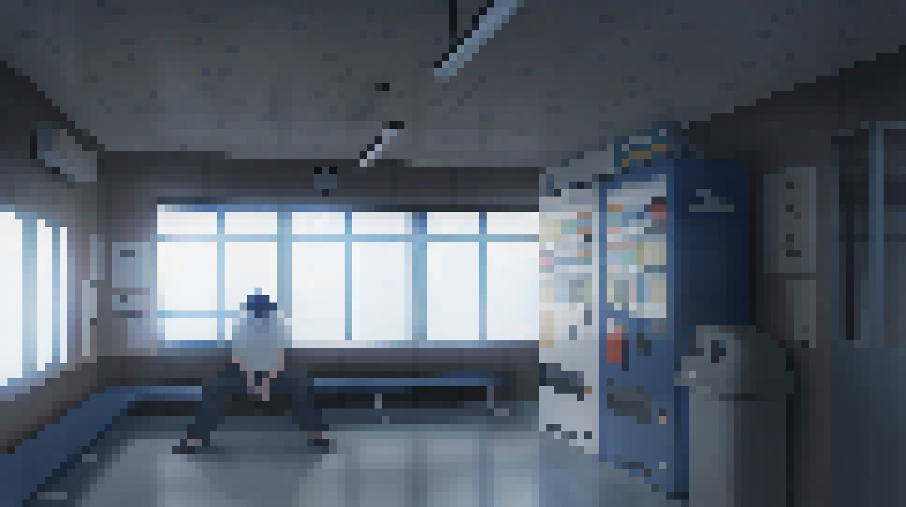

# Image to Pixel Art Generator

This project is an Image to Pixel Art Generator that takes an input image and converts it into pixel art.

## Features

- Convert any image into pixel art.
- Convert any video into pixel art video.
- Adjustable pixel size to control the resolution of the pixel art.
- Supports various image formats (PNG, JPEG, etc.).

## Installation

1. Clone the repository:
    ```bash
    git clone https://github.com/SwapnanilAdhikary/Pixelator.git
    ```
2. Navigate to the project directory:
    ```bash
    cd Pixelator
    ```
3. Install the required dependencies:
    ```bash
    pip install -r requirements.txt
    ```

## Usage

1. Place the image or video you want to convert in the `input_media` directory.
2. Run the script for images:
    ```bash
    python art.py --input input_media/your_image.png --output output_media/pixel_art.png --pixel_size 10
    ```
    Replace `your_image.png` with the name of your image file and adjust the `--pixel_size` parameter as needed.

3. Run the script for videos:
    ```bash
    python art.py --input input_media/your_video.mp4 --output output_media/pixel_art_video.mp4 --pixel_size 10
    ```
    Replace `your_video.mp4` with the name of your video file and adjust the `--pixel_size` parameter as needed.

## Examples

Here is an example of an output image:



And here is a demo of the pixel art video conversion:

<video width="320" height="240" controls>
  <source src="pixel_art_demo.mp4" type="video/mp4">
  Your browser does not support the video tag.
</video>

## Contributing

Contributions are welcome! Please open an issue or submit a pull request.
